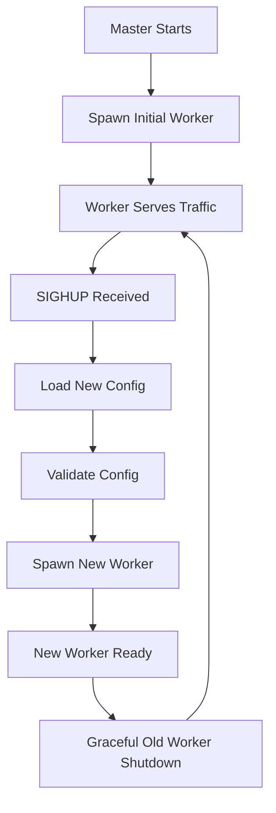

# Hot Reload & Zero-Downtime Configuration Updates

BWS implements a production-grade master-worker architecture that enables true hot reloading of configuration without dropping connections or interrupting service. This feature is essential for production environments where service availability is critical.

## Architecture Overview

BWS uses a master-worker process model similar to nginx, HAProxy, and other enterprise-grade web servers:

```
Master Process (PID 1234)
├── Configuration monitoring
├── Signal handling
├── Worker lifecycle management
└── Graceful shutdown coordination

Worker Process (PID 5678)
├── HTTP request handling
├── SSL/TLS termination
├── Proxy and load balancing
└── Static file serving
```

### How It Works

1. **Master Process**: Monitors configuration files and manages worker processes
2. **Worker Processes**: Handle actual HTTP traffic and connections
3. **Hot Reload**: Master spawns new workers with updated config while old workers gracefully finish
4. **Zero Downtime**: No connection drops or service interruption during configuration updates

## Master-Worker Architecture

### Master Process Responsibilities

- Monitor configuration file changes
- Handle reload signals (SIGHUP)
- Spawn new worker processes
- Gracefully terminate old workers
- Coordinate shutdown procedures

### Worker Process Responsibilities

- Process HTTP requests
- Handle SSL/TLS connections
- Serve static files
- Proxy requests to backends
- Execute middleware

### Process Lifecycle



## Configuration Hot Reload

### Triggering Hot Reload

Hot reload can be triggered in several ways:

#### Using Unix Signals
```bash
# Find master process
pgrep -f "bws.*master"

# Send SIGHUP for hot reload
kill -HUP $(pgrep -f "bws.*master")
```

#### Using systemd
```bash
# Reload configuration through systemd
sudo systemctl reload bws
```

#### Using Process Management
```bash
# Direct signal to specific PID
kill -HUP 1234
```

### What Can Be Hot Reloaded

✅ **Supported (Zero Downtime)**:
- Site configurations
- Hostname mappings
- Multi-hostname configurations
- SSL certificate paths
- ACME settings
- Proxy upstream configurations
- Load balancing algorithms
- Static file directories
- Security headers
- Middleware configurations
- Logging settings
- Health check configurations

❌ **Not Supported (Requires Restart)**:
- Server listen ports
- Worker process count
- Core server settings
- TLS protocol versions

### Configuration Validation

Before applying changes, BWS validates the new configuration:

```bash
# The master process automatically:
# 1. Loads new configuration file
# 2. Validates syntax and semantics
# 3. Checks file permissions and paths
# 4. Verifies SSL certificate validity
# 5. Tests upstream connectivity (optional)
```

If validation fails, the master process keeps the existing configuration and logs an error.

## Hot Reload Process

### Step-by-Step Flow

1. **Signal Reception**
   ```bash
   Master Process: Received SIGHUP signal
   ```

2. **Configuration Loading**
   ```bash
   Master Process: Loading configuration from /etc/bws/config.toml
   ```

3. **Validation**
   ```bash
   Master Process: Validating new configuration
   ```

4. **Worker Spawning**
   ```bash
   Master Process: Spawning new worker with PID 9876
   ```

5. **Traffic Transition**
   ```bash
   New Worker: Ready to accept connections
   ```

6. **Graceful Shutdown**
   ```bash
   Master Process: Sending SIGTERM to old worker (PID 5678)
   Old Worker: Finishing existing connections
   Old Worker: Graceful shutdown complete
   ```

### Error Handling

If hot reload fails:

- Invalid configuration: Master logs error and keeps current config
- Worker spawn failure: Master retries and falls back to current worker
- Resource exhaustion: Master logs warning and maintains current worker

## Configuration Examples

### Basic Hot Reload Setup

```toml
# config.toml
[server]
name = "BWS Production Server"

[[sites]]
name = "main-site"
hostname = "example.com"
port = 8080
static_dir = "/var/www/html"

# Add new site without restart
[[sites]]
name = "api-site"
hostname = "api.example.com"
port = 8080
static_dir = "/var/www/api"

[sites.proxy]
enabled = true

[[sites.proxy.upstreams]]
name = "backend"
url = "http://192.168.1.100:3000"
```

### Multi-Hostname Hot Reload

```toml
[[sites]]
name = "company-main"
hostname = "company.com"
# Add new hostnames without restart
hostnames = [
    "www.company.com",
    "company.net",      # New hostname
    "www.company.net"   # New hostname
]
port = 8080
static_dir = "/var/www/company"
```

### SSL Configuration Hot Reload

```toml
[[sites]]
name = "secure-site"
hostname = "secure.example.com"
port = 443

[sites.ssl]
enabled = true
# Update certificate paths without restart
cert_file = "/etc/ssl/certs/new-cert.pem"
key_file = "/etc/ssl/private/new-key.pem"

[sites.ssl.acme]
enabled = true
# Update ACME settings without restart
email = "security@example.com"
```

### Proxy Configuration Hot Reload

```toml
[[sites]]
name = "proxy-site"
hostname = "proxy.example.com"
port = 8080

[sites.proxy]
enabled = true

# Add new upstreams without restart
[[sites.proxy.upstreams]]
name = "backend-1"
url = "http://192.168.1.101:3000"
weight = 3

[[sites.proxy.upstreams]]
name = "backend-2"
url = "http://192.168.1.102:3000"
weight = 2

# Update routing without restart
[[sites.proxy.routes]]
path = "/api/v1/"
upstream = "backend-1"

[[sites.proxy.routes]]
path = "/api/v2/"
upstream = "backend-2"
```

## Monitoring Hot Reload

### Process Monitoring

```bash
# View process tree
pstree -p $(pgrep -f "bws.*master")

# Monitor process status
watch "ps aux | grep bws"

# Check process relationships
ps -eo pid,ppid,cmd | grep bws
```

### Log Monitoring

```bash
# Follow hot reload logs
tail -f /var/log/bws/bws.log | grep -E "(reload|worker|master)"

# Filter for specific events
journalctl -u bws -f | grep "Hot reload"
```

### Health Checking

```bash
# Verify service is responding
curl -I http://localhost:8080/health

# Check configuration version
curl -s http://localhost:8080/api/health | jq '.config_version'

# Test new configuration features
curl -H "Host: new-site.com" http://localhost:8080/
```

## Production Considerations

### Performance Impact

- **Worker Spawn Time**: ~100-500ms depending on configuration complexity
- **Memory Usage**: Brief spike during worker transition
- **CPU Impact**: Minimal, mostly during config validation
- **Connection Handling**: Zero dropped connections

### Best Practices

1. **Configuration Validation**
   ```bash
   # Always validate before reload
   bws --config-check /etc/bws/config.toml
   ```

2. **Gradual Rollouts**
   ```bash
   # Test on staging first
   # Use monitoring to verify health
   # Roll back quickly if issues arise
   ```

3. **Monitoring Setup**
   ```bash
   # Monitor process counts
   # Track memory usage
   # Alert on failed reloads
   ```

4. **Backup Configurations**
   ```bash
   # Version control configurations
   # Keep rollback configs ready
   # Document all changes
   ```

### Systemd Integration

```ini
# /etc/systemd/system/bws.service
[Unit]
Description=BWS Web Server
After=network.target

[Service]
Type=simple
ExecStart=/usr/local/bin/bws --config /etc/bws/config.toml
ExecReload=/bin/kill -HUP $MAINPID
Restart=always
RestartSec=5

[Install]
WantedBy=multi-user.target
```

### Automated Hot Reload

```bash
#!/bin/bash
# hot-reload-on-config-change.sh

CONFIG_FILE="/etc/bws/config.toml"
MASTER_PID=$(pgrep -f "bws.*master")

# Watch for config file changes
inotifywait -m -e modify "$CONFIG_FILE" | while read event; do
    echo "Configuration file changed, triggering hot reload..."
    
    # Validate configuration
    if bws --config-check "$CONFIG_FILE"; then
        echo "Configuration valid, sending SIGHUP"
        kill -HUP "$MASTER_PID"
    else
        echo "Configuration invalid, skipping reload"
    fi
done
```

## Troubleshooting

### Common Issues

**Master Process Not Found**
```bash
# Check if BWS is running
systemctl status bws

# Look for all BWS processes
ps aux | grep bws
```

**Configuration Not Reloading**
```bash
# Check configuration syntax
bws --config-check /etc/bws/config.toml

# Verify file permissions
ls -la /etc/bws/config.toml

# Check logs for errors
journalctl -u bws | tail -20
```

**Worker Process Issues**
```bash
# Check process tree
pstree -p $(pgrep -f "bws.*master")

# Monitor worker spawning
tail -f /var/log/bws/bws.log | grep worker
```

### Debug Mode

```bash
# Start with verbose logging
RUST_LOG=debug bws --config config.toml

# Enable hot reload debugging
RUST_LOG=bws::core::hot_reload=trace bws --config config.toml
```

### Recovery Procedures

**Failed Hot Reload**
```bash
# Check current configuration
curl http://localhost:8080/api/health

# Restart if necessary
systemctl restart bws
```

**Stuck Worker Process**
```bash
# Force kill unresponsive worker
kill -9 $(pgrep -f "bws.*worker")

# Master will spawn new worker automatically
```

## Integration Examples

### With Load Balancer

```bash
# HAProxy health check during reload
backend bws_servers
    option httpchk GET /health
    server bws1 127.0.0.1:8080 check
```

### With Monitoring

```bash
# Prometheus metrics for hot reload events
bws_hot_reload_total{status="success"} 15
bws_hot_reload_total{status="failed"} 1
bws_worker_spawn_duration_seconds 0.342
```

### With CI/CD Pipeline

```yaml
# Deploy script
- name: Update BWS Configuration
  run: |
    # Validate new config
    bws --config-check new-config.toml
    
    # Deploy config
    cp new-config.toml /etc/bws/config.toml
    
    # Hot reload
    systemctl reload bws
    
    # Verify deployment
    curl -f http://localhost:8080/health
```

## Next Steps

- Learn about [Production Deployment](./production.md)
- Set up [Monitoring and Alerting](./monitoring.md)
- Configure [SSL/TLS Management](./ssl-tls.md)
- Explore [Load Balancing](./load-balancing.md)
